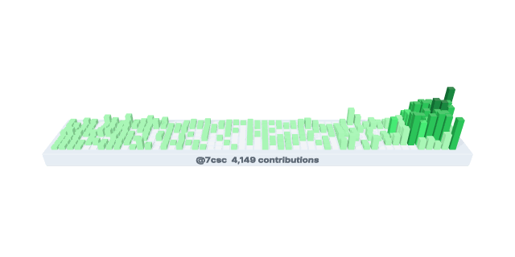
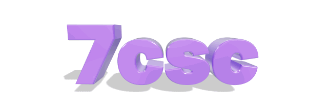
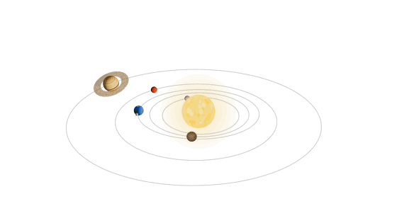
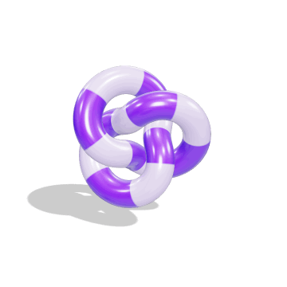

# github-3d-canvas

[English](README.md) | **日本語**

three.js のシーンをヘッドレス Chrome でレンダリングし、GitHub プロフィール README に貼れるループアニメーション（GIF / APNG）を生成する GitHub Action です。

<picture>
  <source media="(prefers-color-scheme: dark)" srcset="dist/contributions-dark.gif">
  
</picture>

<picture>
  <source media="(prefers-color-scheme: dark)" srcset="dist/text-dark.gif">
  
</picture>

<picture>
  <source media="(prefers-color-scheme: dark)" srcset="dist/orbits-dark.gif">
  
</picture>

<picture>
  <source media="(prefers-color-scheme: dark)" srcset="dist/canvas-dark.gif">
  
</picture>

## プリセット

| プリセット | 内容 | 出力 |
|---|---|---|
| `contributions` | コントリビューションカレンダーを 3D の棒グラフ（スカイライン）で表示 | `contributions-*.gif` |
| `text` | ユーザー名などを立体文字で表示 | `text-*.gif` |
| `orbits` | 太陽の周りを惑星がケプラー運動で公転 | `orbits-*.gif` |
| `object` | 組み込みの形状や glTF モデルが回転 | `canvas-*.gif` |

`contributions` と `text` は、既定でリポジトリの持ち主（`{user}`）の名前とデータを使います。

## プロフィールに設置する（GitHub Action）

fork は不要です。自分のプロフィールリポジトリ（`<ユーザー名>/<ユーザー名>`）にワークフローを 1 つ追加するだけで使えます。

**1. ワークフローを追加** — `.github/workflows/3d-canvas.yml`

```yaml
name: 3D canvas

on:
  workflow_dispatch:        # Actions タブから手動実行
  schedule:
    - cron: '0 0 * * *'     # 毎日更新（contributions を使う場合）
  push:
    branches: [main]
    paths:                  # 設定・モデル・テクスチャ・フォントを変えたら再生成
      - '**.json'
      - 'models/**'
      - 'textures/**'
      - 'fonts/**'

permissions:
  contents: write           # 画像をコミットするために必要

concurrency:                # 実行が重なったら古い方を止める
  group: 3d-canvas
  cancel-in-progress: true

jobs:
  render:
    runs-on: ubuntu-latest
    steps:
      - uses: actions/checkout@v7
      - uses: 7csc/github-3d-canvas@v1
        with:
          config: contributions text   # プリセット名、または設定ファイルのパス
```

**2. Actions タブから「3D canvas」を実行** — `dist/contributions-dark.gif` などがコミットされます。

**3. プロフィール README に貼る** — GitHub のテーマに合わせて自動で切り替わります。

```html
<picture>
  <source media="(prefers-color-scheme: dark)" srcset="dist/contributions-dark.gif">
  
</picture>
```

### 入力

| 入力 | 既定値 | 説明 |
|---|---|---|
| `config` | `orbits` | プリセット名か設定ファイルのパス。スペース区切りで複数指定可 |
| `output` | `dist` | 画像の出力先ディレクトリ |
| `commit` | `true` | 生成した画像をコミットして push するか |
| `commit-message` | `chore: render 3D canvas` | コミットメッセージ |
| `user` | リポジトリの持ち主 | 設定内の `{user}` を置き換える GitHub ユーザー名 |
| `token` | `${{ github.token }}` | `contributions` のデータ取得に使うトークン |

出力 `changed` は、画像が前回のコミットから変わったときに `true` になります。

- コミットされるのは `output` ディレクトリだけです。`.gitignore` で無視されていても追加され、他にステージされたファイルは含まれません。
- 描画中にブランチが進んでいた場合は、最新のブランチの上でコミットし直して push します。
- `pull_request` やタグなど、ブランチ上にいないチェックアウトでは描画のみ行い、警告を出してコミットしません。
- 設定に誤りがあると、描画を始める前にファイル名とキー付きのエラーで停止します。
- `contributions` は既定の `github.token` で公開コントリビューションを取得できます。

### カスタマイズ

リポジトリに JSON を置き、`"preset"` で元にするプリセットを指定すると、変えたい項目だけ上書きできます。出力ファイル名は JSON のファイル名になります（`my-text.json` → `dist/my-text-dark.gif`）。

```json
{
  "preset": "text",
  "text": { "value": "Hello,\nWorld" },
  "material": { "color": "#f97316" }
}
```

```yaml
      - uses: 7csc/github-3d-canvas@v1
        with:
          config: my-text.json
```

- オブジェクトはマージされ、配列（`planets` など）は丸ごと置き換わります。
- 省略したキーには既定値が入るので、`preset` を使わない設定ファイルでも必要な項目だけ書けば動きます。
- テーマを `null` にするとその画像は出力されません。
- `model`、`material.texture`、`text.font` には自分のリポジトリ内のファイル（`models/logo.glb`、`textures/wood.jpg`、`fonts/NotoSansJP-Bold.otf` など）を指定できます。パスは大文字小文字を区別します。

### 透明背景（APNG）

`"format": "apng"` にすると、半透明を含むアニメーション PNG を出力します。背景を `"transparent"` にすれば、ダーク・ライトどちらのテーマでも 1 枚で自然に表示できます。

```json
{
  "preset": "object",
  "format": "apng",
  "themes": { "light": null, "dark": { "background": "transparent" } }
}
```

```html

```

APNG はフルカラー相当の見た目ですが、GIF よりファイルが大きくなりやすいので `frames` やサイズで調整してください。GIF は半透明を扱えないため、`"transparent"` は APNG でのみ使えます。

## 設定

### 共通

| キー | 既定値 | 説明 |
|---|---|---|
| `preset` | — | 元にするプリセット名。指定した項目だけ上書きされます |
| `scene` | `object` | `object` / `orbits` / `contributions` |
| `name` | 設定ファイル名 | 出力ファイル名の接頭辞 |
| `format` | `gif` | `gif` または `apng` |
| `width` / `height` | シーンごと | 出力サイズ（px、16〜2000） |
| `frames` / `fps` | シーンごと / `30` | フレーム数（1〜1000）と再生速度（1〜50）。`frames / fps` 秒で 1 ループ |
| `supersample` | `2` | 内部解像度の倍率（1〜4 の整数、アンチエイリアス用） |
| `themes.<name>.background` | `dark` / `light` | 背景色（`#rgb` / `#rrggbb`、APNG では `transparent` も可）。テーマごとに画像が 1 枚出力されます（`null` で出力しない） |

### `object` シーン（プリセット `object` / `text`）

1 つのモデルが床に影を落としながらアニメーションします。

| キー | 既定値 | 説明 |
|---|---|---|
| `model` | `torusKnot` | `torusKnot` / `sphere` / `box` / `icosahedron` / `text`、またはリポジトリ内の `.glb` / `.gltf`（Draco / Meshopt / KTX2 圧縮にも対応） |
| `animation` | `spin`（`text` は `sway`） | `spin`（回転＋傾き）/ `turntable`（水平回転）/ `sway`（左右に揺れる。正面を向きやすいので文字向き） |
| `material.color` | `#8b5cf6` | ベースカラー |
| `material.texture` | `none` | `stripes` / `checker` / `none`、または画像パス（png / jpg / webp / gif / svg） |
| `material.metalness` / `roughness` / `clearcoat` | `0.2` / `0.3` / `1` | PBR パラメータ（0〜1） |
| `themes.<name>.shadowOpacity` | `0.4` | 床の影の濃さ |

`material` は組み込みモデルと文字に適用されます。glTF モデルはファイルに含まれるマテリアルをそのまま使います。

`model: "text"` のときの設定:

| キー | 既定値 | 説明 |
|---|---|---|
| `text.value` | `{user}` | 表示する文字列。`\n` で改行 |
| `text.font` | `inter` | 同梱の Inter（ラテン文字）、またはリポジトリ内の `.ttf` / `.otf` / `.woff`。日本語は日本語フォントのファイルを指定してください |
| `text.weight` | `700` | `inter` の太さ（`400` / `700` / `900`） |
| `text.depth` | `0.3` | 文字の厚み |
| `text.bevel` | `true` | 角を丸めるか |
| `text.lineHeight` | `1.2` | 行間 |

### `contributions` シーン（プリセット `contributions`）

直近 1 年のコントリビューションを、1 日 1 本の棒で表示します。高さはコントリビューション数、色は GitHub と同じ 4 段階です。

| キー | 既定値 | 説明 |
|---|---|---|
| `contributions.user` | `{user}` | 表示するユーザー |
| `contributions.animation` | `sway` | `sway`（左右に揺れる）/ `turntable`（1 回転） |
| `contributions.elevation` | `32` | カメラの見下ろし角度（0〜90 度） |
| `contributions.heightScale` | `1` | 棒の高さの倍率 |
| `contributions.label` | `true` | 台座の前面にユーザー名と合計数を表示するか |
| `contributions.data` | — | GitHub から取得する代わりに使うデータ。`{ "weeks": [[日,月,…,土], …] }`（最大 60 週、欠けた日は `null`） |
| `themes.<name>.levels` | GitHub の配色 | 5 色の配列（0 件、レベル 1〜4）。背景の明暗に合わせて既定値が選ばれます |
| `themes.<name>.base` / `labelColor` | 背景に合わせて自動 | 台座とラベルの色 |

### `orbits` シーン（プリセット `orbits`）

太陽の周りを惑星が楕円軌道で公転します。公転はケプラーの方程式に従い、近日点付近ほど速く動きます。

| キー | 既定値 | 説明 |
|---|---|---|
| `orbits.elevation` | `24` | カメラの見下ろし角度（0〜90 度）。角度に関係なく全体が収まるようにカメラ距離を自動調整します |
| `orbits.sunColor` / `sunRadius` | `#ffb347` / `0.75` | 太陽の色と半径 |
| `orbits.seed` | `7` | テクスチャや星空の乱数シード |
| `orbits.planets` | 5 惑星 | 惑星の配列。下表参照 |
| `themes.<name>.orbitColor` / `orbitOpacity` | `#ffffff` / `0.3` | 軌道線の色と不透明度 |
| `themes.<name>.stars` | `true` | 背景の星を表示するか |

惑星ごとの設定（**必須**は `distance` と `orbits` のみ）:

| キー | 既定値 | 説明 |
|---|---|---|
| `distance` | — | 軌道長半径（0 より大きい数） |
| `orbits` | — | 1 ループあたりの公転回数（**整数**。継ぎ目なくループさせるため。負数で逆回り） |
| `color` / `radius` | `#9ca3af` / `0.2` | 色と半径 |
| `texture` | `rocky` | `rocky` / `gas` / `ocean` / `plain` |
| `eccentricity` / `inclination` | `0` / `0` | 離心率（0〜0.95）・軌道傾斜角（度） |
| `spin` / `tilt` | `3` / `10` | 1 ループあたりの自転回数（整数）と自転軸の傾き（度） |
| `ring` / `ringColor` | `false` / 惑星の色 | 環を付けるか、その色 |
| `moon` | なし | `{ "radius", "distance", "orbits", "color" }` で衛星を 1 つ追加（`color` 以外必須） |

```json
"planets": [
  { "color": "#3b82f6", "texture": "ocean", "radius": 0.22, "distance": 2.7, "orbits": 3,
    "moon": { "color": "#d1d5db", "radius": 0.06, "distance": 0.42, "orbits": 9 } },
  { "color": "#d6a35c", "texture": "gas", "radius": 0.42, "distance": 5.5, "orbits": 1, "ring": true, "tilt": 24 }
]
```

## ローカルで実行する

```sh
npm install
npm run render                                    # 全プリセットを out/ に描画
node src/render.js --help                         # オプション一覧
node src/render.js --user octocat text            # {user} を指定して描画（既定の出力先は dist/）
GITHUB_TOKEN=$(gh auth token) node src/render.js --user octocat contributions
node src/render.js --workspace ../profile my.json # 別のリポジトリの設定・アセットを使う
npm test                                          # 単体テスト
```

設定ファイルや `model` / `texture` / `font` のパスは `--workspace`（省略時はカレントディレクトリ）からの相対パスです。

`dist/` の画像は CI（Linux）で描画したものをコミットしています。OS によって描画結果がわずかに異なるため、ローカルで描画した画像は `dist/` にコミットしないでください（`npm run render` は `.gitignore` 済みの `out/` に出力します）。

## 補足

- GIF は 256 色なので、グラデーションの多いシーンはバンディングが出やすくなります。
- GIF では前フレームから変化のない領域を透明ピクセルとして書き出し、ファイルサイズを抑えています。
- サイズが大きい場合は `frames` か `width` / `height` を下げてください（10 MB を超えると警告が出ます）。
- フレーム間隔は 1/100 秒単位です。端数は各フレームに振り分けるので、ループ全体の長さは `frames / fps` 秒ちょうどになります。

## ライセンス

[MIT](LICENSE)。同梱フォント Inter は SIL Open Font License 1.1（`@fontsource/inter`）です。
